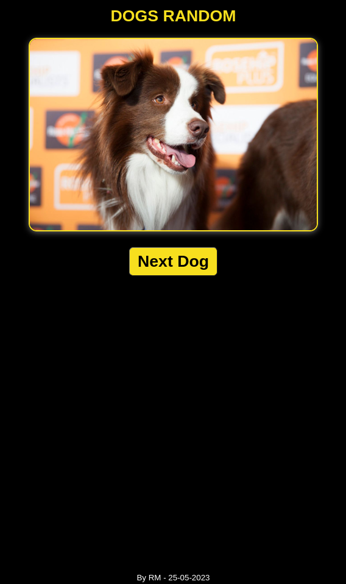

<h3>Hello Visitor!!</h3>

# Project: A simple page with a dogs api

## Website:

- [click here](https://roddevwork.github.io/dogs-api/)

<kbd>
 
</kbd> 
 
 ---

## Description:

-A single page api fetch with responsive website design

-api: https://thedogapi.com/

-Using fetch() with async-await

-Using CSS 

## FullDescription:

-first: we look for the Dogs api

-second: With fetch we query the data, 

-third: We process data using async-await

-fourth:  we use Css to styles

## Author:

-RM
